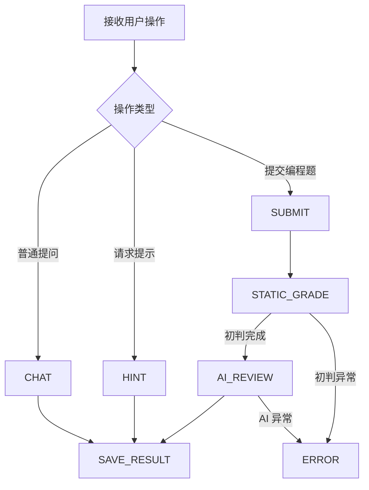

# CodeStory AI 助手 V1 开发路线

> 文档版本：V1.0  
> 更新日期：2026-06-11  
> 配套需求文档：[CodeStory AI 助手模块需求文档 V1.0](./CodeStory_AI助手模块需求文档_V1.0.md)

## 1. 文档目的

本文档用于指导 CodeStory AI 助手第一版的开发顺序。

开发过程同时承担两个目标：

1. 完成 CodeStory AI 助手第一版。
2. 练习已经学习过的 LangChain 和 LangGraph 基础能力。

推荐遵循以下原则：

- 先实现独立、容易验证的 AI 能力。
- 再实现会话状态和无沙箱 AI 编程题评阅。
- 各个模块能够独立运行后，再使用 LangGraph 编排。
- 不要一开始同时处理聊天、代码执行、评分和复杂 Agent。
- V1 明确不引入代码执行沙箱，编程题采用“静态初判 + AI 结构化评阅”的轻量方案。

## 2. 总体开发顺序

```text
阶段一：小节 AI 对话
    ↓
阶段二：AI 结构化代码评审
    ↓
阶段三：三级提示
    ↓
阶段四：会话与消息记录
    ↓
阶段五：无沙箱 AI 编程题评阅
    ↓
阶段六：AI 评分整合与提交记录
    ↓
阶段七：LangGraph 流程编排
    ↓
阶段八：选择题 AI 解释与整体收尾
```

## 3. 阶段一：小节 AI 对话

### 3.1 阶段目标

在小节学习页面实现最基础的 AI 对话：

```text
当前小节内容
+ 当前练习信息
+ 用户问题
→ LangChain
→ AI 流式回复
```

这一阶段先让 AI 能够正常理解小节并回答问题，不处理代码执行和复杂状态。

### 3.2 练习的 LangChain 知识

- 模型初始化与调用
- `ChatPromptTemplate`
- System Message 与 User Message
- Runnable 链式调用
- 流式输出
- 基础错误处理
- 环境变量和模型配置

### 3.3 实现清单

- [ ] 创建独立的 AI 服务目录。
- [ ] 配置模型 API Key、模型名称和超时时间。
- [ ] 实现基础模型调用。
- [ ] 编写小节导师 System Prompt。
- [ ] 将当前小节标题和正文注入 Prompt。
- [ ] 将当前练习题信息注入 Prompt。
- [ ] 实现用户消息接口。
- [ ] 实现 AI 流式响应。
- [ ] 在小节页面接入聊天区域。
- [ ] 支持停止当前生成。
- [ ] 处理模型超时和调用失败。

### 3.4 建议 Prompt 输入

```text
课程名称
章节名称
小节标题
小节正文
当前练习题
用户问题
```

### 3.5 完成标准

- 用户能够在小节页面发送消息。
- AI 回复能够流式展示。
- AI 能够引用当前小节内容进行回答。
- AI 不会把自己描述成通用聊天机器人。
- AI 调用失败时页面能够明确提示。

### 3.6 本阶段暂不实现

- 数据库消息记录
- 长期记忆
- 向量数据库
- RAG
- Tool Calling
- LangGraph
- 代码执行
- AI 评分

## 4. 阶段二：AI 结构化代码评审

### 4.1 阶段目标

实现一个独立的无沙箱 AI 编程题评阅能力。

输入：

```text
题目要求
+ 编程语言
+ 学生代码
+ 标准答案或参考答案
+ 静态初判结果
+ 已使用提示等级
+ 固定评分 Rubric
```

输出：

```text
是否大概率正确
+ 功能理解分
+ 代码质量分
+ 用户可读反馈
+ 优点
+ 问题证据
+ 下一步建议
+ 是否需要人工复核
```

V1 不引入代码执行沙箱。AI 评阅不实际运行学生代码，而是根据题目要求、参考答案、学生答案、静态初判结果和固定 Rubric 给出结构化评价。

### 4.2 练习的 LangChain 知识

- Structured Output
- Zod Schema
- 输出解析和类型校验
- 结构化 Prompt
- 模型重试
- 输出修复
- 固定 Rubric
- Prompt Injection 防护

### 4.3 AI 评阅输出示例

```json
{
  "isLikelyCorrect": true,
  "functionalScore": 62,
  "qualityScore": 24,
  "feedback": "整体思路正确，但筛选条件还可以写得更严谨。",
  "strengths": ["使用了正确的查询结构"],
  "issues": ["WHERE 条件没有完全覆盖题目限制"],
  "suggestions": ["重新核对题目中的字段和筛选条件"],
  "needsManualReview": false
}
```

### 4.4 实现清单

- [ ] 定义无沙箱 AI 评阅输入类型。
- [ ] 使用 Zod 定义 AI 输出结构。
- [ ] 编写固定评分 Rubric。
- [ ] 编写代码评审 Prompt。
- [ ] 强制限制功能分和质量分的范围。
- [ ] 限制优点最多 2 项。
- [ ] 限制问题最多 3 项。
- [ ] 要求每个问题包含代码或测试证据。
- [ ] 实现结构化输出校验。
- [ ] 实现输出失败重试。
- [ ] 实现 AI 评审失败降级。
- [ ] 测试代码注释中的 Prompt Injection。

### 4.5 评分范围

| 维度 | 分值 |
| --- | ---: |
| 功能理解与题意匹配 | 0-70 |
| 代码质量与表达清晰度 | 0-30 |

AI 可以给出“大概率正确”判断和分数，但该判断属于智能评阅结果，不等同于真实执行测试结论。

### 4.6 完成标准

- AI 每次返回符合 Schema 的结构化数据。
- 各评分维度不会超过规定范围。
- 评价包含具体证据。
- AI 不会因为代码注释中的指令给出满分。
- AI 失败时能够返回明确的失败状态。
- AI 失败时不会影响代码提交保存。

### 4.7 本阶段暂不实现

- 真实代码运行
- 数据库评审记录
- LangGraph 编排

## 5. 阶段三：三级提示

### 5.1 阶段目标

根据题目、学生代码、测试摘要和提示等级生成不同程度的帮助。

```text
题目
+ 学生代码
+ 测试失败摘要
+ 当前提示等级
→ 对应等级的提示
```

### 5.2 练习的 LangChain 知识

- 动态 Prompt 参数
- Prompt 模板复用
- 条件选择
- 结构化提示输出
- 固定内容与 AI 内容组合
- 输出内容约束

### 5.3 提示等级

| 等级 | 提示内容 |
| --- | --- |
| Level 1 | 只提供思考方向和相关概念 |
| Level 2 | 指出错误范围、边界场景和算法步骤 |
| Level 3 | 提供伪代码、函数结构或关键表达式 |

### 5.4 实现清单

- [ ] 定义提示输入和输出 Schema。
- [ ] 为三个等级编写明确规则。
- [ ] 优先读取管理员配置的固定提示。
- [ ] 没有固定提示时调用 AI。
- [ ] AI 生成内容不得超过当前等级。
- [ ] 保存本次提示等级和提示来源。
- [ ] 防止 Level 1 和 Level 2 输出完整答案。
- [ ] 为提示预留扣分信息。

### 5.5 完成标准

- 三个提示等级存在明显区别。
- 提示能够关联当前代码问题。
- 低等级提示不会泄露完整答案。
- 同一题目不会重复返回完全相同的无效提示。
- 固定提示与 AI 提示能够正常切换。

## 6. 阶段四：会话与消息记录

### 6.1 阶段目标

将前面完成的 AI 对话和提示能力持久化。

需要实现：

- AI 会话创建与恢复
- 用户消息保存
- AI 消息保存
- 当前练习保存
- 当前提示等级保存
- 历史消息加载

### 6.2 练习的 LangChain 知识

- Message History
- Human Message、AI Message、System Message
- 短期记忆
- 历史消息裁剪
- 会话隔离
- 上下文重新组装

### 6.3 实现清单

- [ ] 复用或调整 `ai_chat_sessions` 模型。
- [ ] 新增聊天消息数据模型。
- [ ] 创建或查询当前小节会话。
- [ ] 保存用户发送的消息。
- [ ] 保存 AI 完成的消息。
- [ ] 区分普通问答、提示和代码分析消息。
- [ ] 加载最近 N 条历史消息。
- [ ] 防止不同用户或不同小节串话。
- [ ] 刷新页面后恢复聊天记录。
- [ ] 保存当前练习和提示等级。

### 6.4 历史消息策略

第一版采用简单策略：

```text
System Prompt
+ 当前小节内容
+ 最近 N 条聊天消息
+ 当前用户消息
```

暂不实现复杂长期记忆和向量检索。

### 6.5 完成标准

- 刷新页面后聊天记录仍然存在。
- 不同用户之间不会读取到彼此消息。
- 不同小节之间的会话互不影响。
- 历史消息数量受到限制。
- 页面刷新不会重复调用 AI。

## 7. 阶段五：无沙箱 AI 编程题评阅

### 7.1 阶段目标

用无沙箱 AI 评阅替代单纯的标准答案字符串比较。

```text
学生代码
→ 保存代码提交
→ 静态初判
→ AI 结构化评阅
→ 返回分数、反馈和复核建议
```

该模块主要练习 LangChain 结构化输出、Prompt 约束、AI 结果校验和后端数据持久化。

### 7.2 实现范围

第一版只支持：

- 不执行用户代码。
- 不引入容器、沙箱或第三方判题服务。
- 支持 SQL、伪代码或普通代码文本的 AI 评阅。
- 使用标准答案、题目解析和静态初判结果辅助 AI 判断。
- 每次提交都保存到 `code_submissions`。
- AI 调用失败时降级为静态初判结果。

### 7.3 实现清单

- [ ] 新增每次代码提交记录。
- [ ] 保存学生代码、语言、提示扣分和静态初判结果。
- [ ] 定义 AI 评阅输入和输出 Schema。
- [ ] 将题目、标准答案、解析、学生代码和静态初判结果传给 AI。
- [ ] 要求 AI 返回 `isLikelyCorrect`、`functionalScore`、`qualityScore` 和 `feedback`。
- [ ] 将 AI 评阅写入 `code_submissions.ai_review`。
- [ ] 保存模型名称和 Rubric 版本。
- [ ] AI 失败时标记 `ai_review_status = failed` 并保留静态初判结果。
- [ ] 防止代码注释中的 Prompt Injection 影响评分。

### 7.4 完成标准

- 两份写法不同但思路等价的代码，AI 可以给出合理评价。
- 明显错误的代码能够获得低分和具体反馈。
- 每次提交都有对应的 `code_submissions` 记录。
- AI 评阅结果符合 Schema，分数不会越界。
- AI 服务不可用时，提交接口仍然可用。
- 页面和文案明确表达这是“AI 智能评阅”，不是严格运行判题。

## 8. 阶段六：AI 评分整合与提交记录

### 8.1 阶段目标

将静态初判、AI 评阅分和提示扣分组合成最终成绩。

```text
AI 功能分 70 分
+ AI 质量分 30 分
- 提示扣分
→ 最终成绩
```

### 8.2 实现清单

- [ ] 根据 AI 评阅结果计算功能分。
- [ ] 根据 AI 评阅结果计算质量分。
- [ ] 将静态初判结果作为 AI 评阅参考，不作为唯一结论。
- [ ] 应用提示扣分。
- [ ] 保存最终成绩和分项成绩。
- [ ] 保存模型版本和 Rubric 版本。
- [ ] 防止同一提交重复计分。
- [ ] 支持 AI 评审失败后单独重试。

### 8.3 异常规则

- 静态初判失败：仍可继续进行 AI 评阅。
- AI 评审失败：保留静态初判分，质量分标记为待评审或 0 分。
- AI 评审失败不得导致提交接口失败。
- AI 评阅低置信度：标记 `needsManualReview = true`。
- 同一个 `submissionId` 不得重复更新用户积分。

### 8.4 完成标准

- 最终分数可以拆解到每个评分维度。
- 静态初判和 AI 评阅的职责没有混淆。
- 每次评分都能关联具体提交。
- AI 服务不可用时仍然能够展示静态初判结果。
- 重试不会导致重复计分。

## 9. 阶段七：LangGraph 流程编排

### 9.1 阶段目标

各个独立模块稳定后，使用 LangGraph 统一编排流程。

LangGraph 不负责实现模型调用和判题逻辑，只负责：

- 保存流程状态
- 根据用户操作选择节点
- 根据执行结果进行分支
- 统一处理失败和恢复

### 9.2 练习的 LangGraph 知识

- State 定义
- Node
- Edge
- Conditional Edge
- Checkpoint
- 状态恢复
- 错误分支
- 节点输入输出约束

### 9.3 第一版节点

| 节点 | 作用 |
| --- | --- |
| `CHAT` | 处理当前小节问答 |
| `SUBMIT` | 接收练习提交 |
| `STATIC_GRADE` | 执行静态初判并生成基础提交结果 |
| `AI_REVIEW` | 生成无沙箱 AI 编程题评阅 |
| `HINT` | 返回当前等级提示 |
| `SAVE_RESULT` | 保存消息、提交或评分 |
| `ERROR` | 处理模型或评阅异常 |

### 9.4 状态建议

```ts
interface LearningState {
  userId: string;
  lessonId: string;
  exerciseId?: string;
  action: "chat" | "submit" | "hint";
  userMessage?: string;
  code?: string;
  hintLevel: number;
  staticGrade?: StaticGrade;
  aiReview?: AiReview;
  error?: string;
}
```

### 9.5 流程图



### 9.6 实现清单

- [ ] 定义第一版 Graph State。
- [ ] 将已有模块包装成独立节点。
- [ ] 根据用户操作设置条件分支。
- [ ] 为静态初判失败和 AI 失败设置不同分支。
- [ ] 接入 Checkpoint 或现有会话状态。
- [ ] 支持从必要状态恢复流程。
- [ ] 确保节点重试不会重复保存或计分。
- [ ] 记录每个节点的耗时和错误。

### 9.7 完成标准

- 聊天、提示和代码提交能够进入正确分支。
- 静态初判完成后才会执行 AI 评阅。
- 静态初判异常和 AI 异常能够分别处理。
- 流程恢复不会重复执行已经完成的副作用。
- LangGraph 状态只保存流程需要的数据。

## 10. 阶段八：选择题 AI 解释与整体收尾

### 10.1 阶段目标

在不改变选择题原有判分的前提下，补充可选的 AI 解释，并完成整体体验。

### 10.2 实现清单

- [ ] 选择题提交继续使用数据库答案判分。
- [ ] 用户点击“解释答案”时调用 AI。
- [ ] AI 解释正确选项。
- [ ] AI 说明其他选项的问题。
- [ ] AI 解释不参与成绩计算。
- [ ] 完成加载、错误、重试和空状态 UI。
- [ ] 完成接口限流。
- [ ] 完成 token、耗时和失败率统计。
- [ ] 完成核心流程测试。

### 10.3 完成标准

- AI 不可用时选择题仍然可以正常提交。
- AI 解释不会修改正确性和分数。
- 用户可以完成完整的小节学习流程。
- 所有关键异常都有清晰提示。

## 11. 推荐学习顺序

整个开发过程对应的 LangChain / LangGraph 学习路线如下：

```text
模型调用
→ Prompt 模板
→ 流式输出
→ 结构化输出
→ 输出校验与重试
→ Message History
→ 会话记忆与裁剪
→ 条件分支
→ Tool 或服务调用
→ LangGraph State
→ Node 与 Conditional Edge
→ Checkpoint 与状态恢复
```

## 12. 每个阶段的开发方式

每个阶段都按下面的循环进行：

1. 先定义输入和输出。
2. 编写最小可运行实现。
3. 使用固定测试数据验证。
4. 处理失败和异常。
5. 增加数据持久化。
6. 编写测试或准备可重复的测试用例。
7. 确认完成标准后再进入下一阶段。

不要在当前阶段未完成时提前引入后续阶段的复杂度。

## 13. 开发前需要先决定

正式开始前，需要确认：

1. 使用哪个模型供应商和模型。
2. AI 模块继续放在 Express 后端，还是建立独立 AI 服务。
3. 无沙箱 AI 评阅的 Rubric 和分值比例。
4. `functionalScore`、`qualityScore` 和提示扣分的合成规则。
5. AI 评阅失败时使用静态初判分，还是标记为待评阅。
6. 提示的具体扣分规则。
7. 用户成绩保存最高分还是最近一次得分。

## 14. 第一版完成标志

完成以下流程后，CodeStory AI 助手 V1 即可视为基本完成：

```text
用户进入小节
→ 与 AI 讨论当前知识
→ 提交选择题或编程题
→ 选择题通过数据库判分
→ 编程题保存提交并进行静态初判
→ AI 对编程题进行无沙箱结构化评阅
→ 用户可以逐级获取提示
→ 对话、提交和评分能够保存
→ LangGraph 能够编排和恢复流程
```
