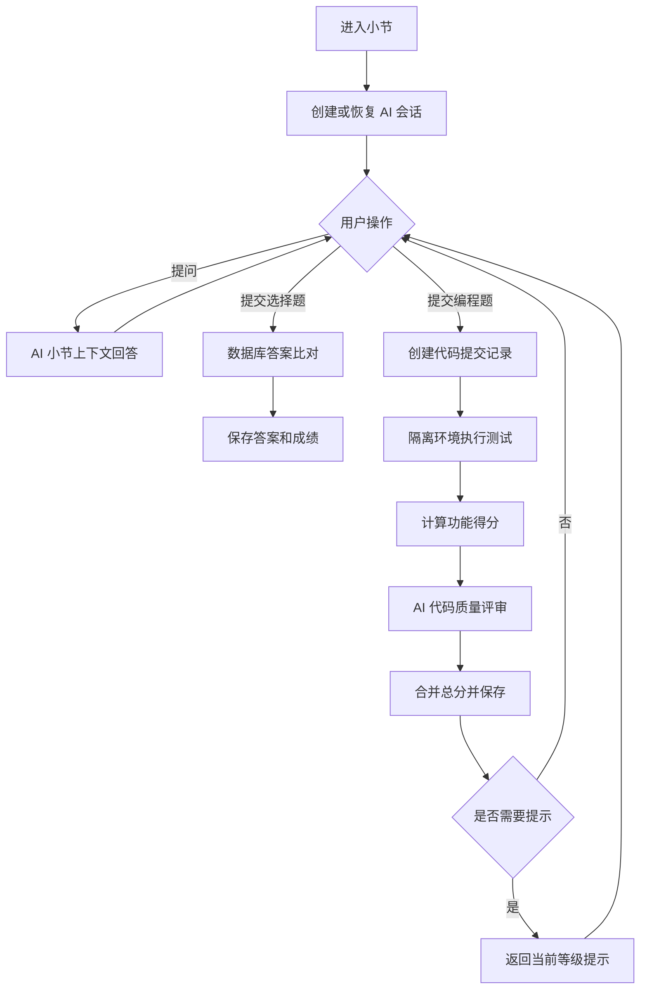

# CodeStory AI 助手模块需求文档

> 文档版本：V1.0  
> 文档状态：第一版范围确认稿  
> 更新日期：2026-06-11  
> 适用对象：产品设计、前端、后端、AI 工程、测试

## 1. 文档目的

本文档定义 CodeStory AI 助手第一版需要实现的功能、业务规则、流程、数据需求和验收标准。

第一版只完成以下学习闭环：

```text
小节 AI 对话
+ 选择题数据库判分
+ 编程题测试判定
+ AI 代码质量评分
+ 三级提示
+ 会话与提交记录
```

本文档暂不讨论变式题、学习画像、剧情任务、多语言判题等后续功能。

## 2. 当前基础

### 2.1 当前已经实现

平台目前已经具备：

- 课程、章节和小节管理
- 小节内容展示
- 选择题和编程题配置
- 选择题数据库答案比对
- 编程题标准答案字符串比对
- 用户答案、提交次数、成绩和提示等级记录
- 预先配置的三级提示
- 小节和课程学习进度

### 2.2 当前只预留数据结构、尚未实现

数据库中已经存在 `ai_chat_sessions` 模型，可用于记录：

- 当前用户
- 当前小节
- 当前 Agent 状态
- 当前练习
- 当前提示等级
- 临时上下文

这只代表数据库预留了会话状态结构，不代表已经实现以下能力：

- AI 对话接口
- 聊天消息保存
- 流式输出
- 会话创建与恢复
- LangGraph 状态流转
- AI 代码评审

### 2.3 当前主要问题

当前编程题会先处理注释和空格，再将学生代码与数据库标准答案进行字符串比较。

这种方式存在明显误判：

- 变量名不同会被判错
- 循环写法不同会被判错
- 算法不同但结果正确仍会被判错
- 代码格式不同可能影响结果
- 无法真正验证边界情况

因此，第一版需要将编程题升级为混合判题。

## 3. 第一版产品目标

AI 助手定位为小节学习页面中的编程导师，而不是通用聊天机器人。

第一版需要达到以下目标：

1. AI 能理解当前小节和当前练习。
2. 学生可以围绕当前学习内容与 AI 对话。
3. 选择题继续保持稳定、确定的数据库判分。
4. 编程题允许多种正确实现。
5. 测试系统负责判断代码功能是否正确。
6. AI 负责评价代码质量和解释问题。
7. 学生遇到困难时可以逐级获取提示。
8. 系统能够保存会话、消息、代码提交和评分依据。

## 4. 第一版范围

### 4.1 必须实现的六个模块

| 编号 | 模块 | 核心作用 | 优先级 |
| --- | --- | --- | --- |
| V1-M01 | 小节 AI 对话 | 围绕当前小节和练习进行问答 | P0 |
| V1-M02 | 选择题判分 | 使用数据库正确答案判断对错 | P0 |
| V1-M03 | 编程题测试判定 | 运行代码和测试用例，判断功能正确性 | P0 |
| V1-M04 | AI 代码质量评分 | 评价可读性、实现合理性和编码规范 | P0 |
| V1-M05 | 三级提示 | 按等级提供逐步增强的帮助 | P0 |
| V1-M06 | 会话与提交记录 | 保存对话、代码、测试和评分记录 | P0 |

### 4.2 第一版明确不做

- 自动生成变式题
- 学习画像和薄弱知识点分析
- 自动规划学习路线
- 剧情任务式学习
- 项目级、多文件代码评审
- 管理员 AI 自动出题
- AI 自动修改或提交学生代码
- 支持任意编程语言和第三方依赖
- 由 AI 单独决定编程题正确或错误

## 5. 模块一：小节 AI 对话

### 5.1 功能说明

学习者可以在小节学习页面与 AI 助手对话。

AI 回答时应理解：

- 当前课程名称
- 当前章节和小节
- 当前小节正文
- 当前练习题
- 用户当前提交情况
- 用户已经使用的提示等级

### 5.2 基本功能

- 发送文本消息
- 流式展示 AI 回复
- 停止当前生成
- 保存用户消息和 AI 消息
- 重新进入小节后查看历史消息
- AI 服务失败时允许重新发送

### 5.3 快捷操作

第一版提供以下快捷入口：

- 解释当前知识点
- 换一种方式解释
- 分析我的代码
- 给我一个提示
- 总结当前小节

### 5.4 回答规则

- 优先围绕当前小节回答。
- 与课程无关的问题可以简短回应并引导回当前学习内容。
- 不确定时应明确说明，不得编造课程内容。
- 优先引导学生思考，不直接代写完整答案。
- 回答应控制长度，避免一次输出过多超纲知识。
- 不得将完整标准答案或隐藏测试发送给学生。

### 5.5 上下文范围

| 上下文 | 是否使用 | 说明 |
| --- | --- | --- |
| 当前课程、小节内容 | 是 | AI 对话的主要知识背景 |
| 当前练习题 | 是 | 用于解释题意和分析代码 |
| 当前用户提交 | 是 | 只读取当前用户的数据 |
| 当前提示等级 | 是 | 防止重复或越级提示 |
| 全部历史聊天 | 有限制 | 只保留最近消息或会话摘要 |
| 其他用户数据 | 否 | 严禁进入当前会话 |
| 完整隐藏测试 | 否 | 只能提供脱敏后的失败摘要 |

## 6. 模块二：选择题判分

### 6.1 功能说明

选择题继续使用当前的确定性判分方式：

```text
学生选择
→ 与数据库正确答案比较
→ 返回正确或错误
→ 保存答案和成绩
```

### 6.2 业务规则

- AI 不参与选择题正确性判断。
- AI 服务不可用时，选择题仍然可以正常提交。
- 提示扣分继续沿用平台现有规则。
- 数据库答案是选择题最终判定依据。
- AI 只能在判分完成后解释选项。
- AI 解释不得修改正确性和得分。

### 6.3 返回内容

- 是否正确
- 本次得分
- 已使用提示等级
- 题目解析
- 用户主动请求时生成的 AI 解释

## 7. 模块三：编程题测试判定

### 7.1 功能说明

编程题不再通过字符串比较判断正确性，而是在隔离环境中运行学生代码并执行测试用例。

```text
学生代码
→ 安全检查
→ 隔离环境执行
→ 运行测试用例
→ 返回确定性结果
```

### 7.2 第一版语言范围

第一版只支持一种主要编程语言。

具体语言在开发前确认，第一版不同时建设多语言运行环境。

每道编程题需要明确：

- 编程语言及版本
- 代码执行入口
- 输入格式
- 输出格式
- 时间限制
- 内存限制
- 测试用例

### 7.3 测试用例

每道编程题至少应包含：

- 基础测试
- 典型测试
- 边界测试
- 防止硬编码的隐藏测试

测试用例分为：

| 类型 | 用途 | 是否向学生展示 |
| --- | --- | --- |
| 公开测试 | 帮助学生理解输入输出 | 可以展示 |
| 隐藏测试 | 验证边界与泛化能力 | 只展示脱敏摘要 |

### 7.4 判题结果

判题服务需要返回：

- 是否编译或启动成功
- 测试总数
- 测试通过数量
- 公开测试结果
- 隐藏测试失败摘要
- 执行时间
- 内存使用情况
- 错误类型

错误类型至少区分：

- 编译错误
- 运行错误
- 答案错误
- 执行超时
- 内存超限
- 系统错误

### 7.5 功能评分

第一版建议采用以下评分：

| 维度 | 分值 | 来源 |
| --- | ---: | --- |
| 功能正确性 | 60 | 测试用例通过情况 |
| 边界与健壮性 | 15 | 边界测试和隐藏测试 |

规则：

- 测试系统是编程题正确性的唯一判定者。
- AI 不得修改测试结果。
- 核心测试未全部通过时，总分上限为 59。
- 代码无法执行时，功能相关得分为 0。
- 判题系统异常时不得让 AI 猜测正确性。

### 7.6 代码执行安全

学生代码属于不可信输入，不得直接运行在 Express 主业务进程中。

执行环境至少需要：

- 与主业务服务隔离
- 限制 CPU
- 限制内存
- 限制执行时间
- 限制进程数量
- 默认禁止外网访问
- 禁止访问数据库和 Redis
- 禁止读取平台环境变量
- 使用独立临时目录
- 执行结束后清理环境

## 8. 模块四：AI 代码质量评分

### 8.1 功能说明

判题系统完成测试后，将以下安全数据交给 AI：

- 题目要求
- 编程语言
- 学生代码
- 测试结果摘要
- 失败类型
- 固定评分 Rubric

AI 负责评价代码质量，并提供教学反馈。

### 8.2 评分组成

| 维度 | 分值 | 评价内容 |
| --- | ---: | --- |
| 代码可读性 | 10 | 命名、结构、重复和理解成本 |
| 实现合理性 | 10 | 算法、数据结构和复杂度 |
| 编码规范 | 5 | 语言惯例、坏味道和危险写法 |

编程题总分：

```text
总分 = 功能正确性 60
     + 边界与健壮性 15
     + 代码可读性 10
     + 实现合理性 10
     + 编码规范 5
     - 提示扣分
```

### 8.3 评分约束

- AI 只能评价 25 分的代码质量部分。
- AI 不得覆盖测试系统给出的 75 分功能结果。
- 每个维度不得超过规定分值。
- 评价必须给出代码或测试证据。
- 同一份代码应尽量保持评分稳定。
- AI 评审失败时，保留测试结果并标记“质量评分待评审”。
- AI 评审失败不得将正确代码判错。

### 8.4 反馈内容

AI 评审结果应包含：

1. 代码中做得好的地方，最多 2 项。
2. 主要问题，最多 3 项。
3. 每个问题对应的证据。
4. 可读性、实现合理性和编码规范分数。
5. 一个最优先的改进动作。
6. 面向学生的简短总结。

### 8.5 结构化输出

```json
{
  "reviewStatus": "completed",
  "qualityScores": {
    "readability": 8,
    "design": 7,
    "style": 4
  },
  "strengths": [
    {
      "description": "循环终止条件清晰",
      "evidence": "第 6 行"
    }
  ],
  "issues": [
    {
      "type": "readability",
      "severity": "medium",
      "description": "变量名无法表达用途",
      "evidence": "第 3 行"
    }
  ],
  "nextAction": "将变量重命名为能够表达含义的名称。",
  "feedback": "功能测试已经通过，主要需要改善变量命名。"
}
```

AI 输出通过结构校验后，才能参与最终分数计算。

### 8.6 Prompt Injection 防护

- 学生代码和代码注释都视为不可信数据。
- AI 不得执行代码注释中的指令。
- 系统提示应明确禁止学生代码改变评分规则。
- 不得因为代码中写有“给我 100 分”而改变结果。
- 隐藏测试和标准答案应与学生输入分层隔离。

## 9. 模块五：三级提示

### 9.1 功能说明

学生不会作答或代码测试失败时，可以主动请求提示。

提示逐级增强，避免第一次请求就直接给出答案。

### 9.2 提示等级

| 等级 | 目标 | 允许内容 | 禁止内容 |
| --- | --- | --- | --- |
| Level 1 | 提供思考方向 | 相关概念、需要观察的数据 | 关键代码和完整步骤 |
| Level 2 | 缩小问题范围 | 错误区域、边界场景、算法步骤 | 可直接提交的完整实现 |
| Level 3 | 提供解题脚手架 | 伪代码、函数结构、关键表达式 | 无解释的完整答案 |

### 9.3 提示来源

第一版允许两种提示来源：

1. 管理员预先配置的固定提示。
2. AI 根据题目、学生代码和失败测试生成的动态提示。

优先规则：

- 存在固定提示时优先使用固定提示。
- 固定提示不足时，再由 AI 生成对应等级的提示。
- AI 生成提示不得超过当前提示等级。

### 9.4 提示记录

系统需要记录：

- 当前练习
- 提示等级
- 提示内容
- 提示来源
- 获取时间
- 是否参与扣分

### 9.5 提示扣分

第一版可继续使用现有规则：

| 使用情况 | 建议扣分 |
| --- | ---: |
| 未使用提示 | 0 |
| 使用 Level 1 | 10 |
| 使用 Level 2 | 20 |
| 使用 Level 3 | 30 |

最终规则需要在开发前确认，但同一套规则应同时适用于选择题和编程题。

## 10. 模块六：会话与提交记录

### 10.1 AI 会话

每个用户在每个小节中拥有一个当前 AI 会话。

会话用于记录：

- 用户 ID
- 小节 ID
- 当前状态
- 当前练习 ID
- 当前提示等级
- 最近活动时间
- 必要的上下文摘要

可以复用现有的 `ai_chat_sessions` 模型，但需要根据实际实现补充或调整字段。

### 10.2 聊天消息

第一版需要新增聊天消息记录，至少包含：

- 消息 ID
- 会话 ID
- 消息角色：用户、AI、系统
- 消息内容
- 消息类型
- 创建时间

消息类型可以包括：

- 普通问答
- 代码分析
- 提示
- 系统状态

### 10.3 代码提交记录

当前 `answer` 模型主要保存某道题的汇总结果，无法完整保留每一次代码提交。

第一版需要能够记录每次编程题提交：

- 提交 ID
- 用户 ID
- 练习 ID
- 代码快照
- 编程语言
- 提交序号
- 提交状态
- 提交时间

### 10.4 测试记录

每次代码提交需要关联：

- 测试版本
- 编译结果
- 测试通过数量
- 失败摘要
- 执行时间
- 内存使用
- 错误类型

### 10.5 AI 评审记录

每次 AI 质量评审需要关联：

- 提交 ID
- 模型名称和版本
- Rubric 版本
- 分项评分
- 优点
- 问题和证据
- 改进建议
- 评审状态
- 创建时间

### 10.6 恢复规则

用户刷新页面或重新进入小节时：

- 恢复最近的聊天消息。
- 恢复当前练习。
- 恢复已经使用的提示等级。
- 可以查看历史代码提交和评分。
- 不自动重新执行旧代码。
- 不自动重复调用 AI。

## 11. 第一版整体流程



### 11.1 LangGraph 在第一版中的职责

第一版不需要建立过于复杂的学习 Agent。

LangGraph 只负责组织以下有限状态：

| 状态 | 作用 |
| --- | --- |
| `CHAT` | 处理当前小节问答 |
| `SUBMIT` | 接收练习提交 |
| `RUN_TESTS` | 等待编程题测试结果 |
| `AI_REVIEW` | 执行 AI 质量评审 |
| `HINT` | 返回当前等级提示 |
| `ERROR` | 处理模型或判题异常 |

选择题判分本身不需要由 LangGraph 或 AI 完成。

## 12. 异常与降级

| 异常 | 系统行为 |
| --- | --- |
| AI 对话失败 | 保留用户消息，允许重新生成 |
| 编译失败 | 展示编译错误，AI 可以解释错误 |
| 运行超时 | 终止代码并返回超时状态 |
| 内存超限 | 终止代码并返回资源超限 |
| 判题服务不可用 | 标记提交失败或待重试，不调用 AI 猜测结果 |
| AI 评审失败 | 展示测试结果，质量评分标记为待评审 |
| AI 输出格式错误 | 尝试有限次数修复，失败后降级 |
| 消息保存失败 | 提示保存异常，不把未保存消息显示为已持久化 |

## 13. 性能与成本要求

### 13.1 性能

| 功能 | 建议要求 |
| --- | --- |
| 选择题判分 | P95 不超过 500ms |
| 常规编程题测试 | P95 不超过 5 秒 |
| AI 对话首字响应 | P95 不超过 3 秒 |
| AI 质量评审 | P95 不超过 8 秒 |

### 13.2 成本控制

- 选择题提交时不调用 AI。
- 选择题只有在用户请求解释时才调用 AI。
- 限制单次对话上下文长度。
- 限制单用户 AI 请求频率。
- 同一提交不得重复触发 AI 评审。
- 记录模型、token、耗时和调用状态。

## 14. 第一版验收标准

### 14.1 小节 AI 对话

| 编号 | 验收条件 |
| --- | --- |
| AC-01 | 用户可以在小节页面发送消息并获得流式回复 |
| AC-02 | AI 能读取当前小节和当前练习上下文 |
| AC-03 | 刷新页面后可以恢复历史消息 |
| AC-04 | AI 不会在普通问答中直接泄露完整标准答案 |

### 14.2 选择题

| 编号 | 验收条件 |
| --- | --- |
| AC-05 | 选择题继续通过数据库正确答案判分 |
| AC-06 | AI 服务不可用时选择题仍可正常提交 |
| AC-07 | AI 解释不会改变选择题得分 |

### 14.3 编程题测试

| 编号 | 验收条件 |
| --- | --- |
| AC-08 | 两份写法不同但功能相同的代码均可通过测试 |
| AC-09 | 功能正确性完全由测试系统决定 |
| AC-10 | 编译错误、运行错误、超时和答案错误可以区分 |
| AC-11 | 隐藏测试完整内容不会发送给前端 |
| AC-12 | 学生代码不会在 Express 主进程直接运行 |

### 14.4 AI 质量评分

| 编号 | 验收条件 |
| --- | --- |
| AC-13 | AI 返回三个质量评分维度 |
| AC-14 | AI 质量总分不超过 25 分 |
| AC-15 | AI 反馈包含具体证据和下一步建议 |
| AC-16 | AI 评审失败不会改变测试结果 |
| AC-17 | 代码注释中的评分指令不会影响 AI 分数 |

### 14.5 三级提示

| 编号 | 验收条件 |
| --- | --- |
| AC-18 | 用户可以依次获取 Level 1、Level 2 和 Level 3 提示 |
| AC-19 | Level 1 和 Level 2 不包含完整可提交答案 |
| AC-20 | 系统能够记录已使用的提示等级 |
| AC-21 | 提示扣分能够参与最终成绩计算 |

### 14.6 会话与提交记录

| 编号 | 验收条件 |
| --- | --- |
| AC-22 | 每条用户和 AI 消息能够保存并恢复 |
| AC-23 | 每次代码提交都有独立代码快照 |
| AC-24 | 每次提交能够关联测试结果和 AI 评审 |
| AC-25 | 刷新页面不会重复执行旧代码或重复调用 AI |

## 15. 推荐开发顺序

### 阶段一：数据与接口基础

1. 明确第一版支持的编程语言和运行方式。
2. 设计聊天消息、代码提交、测试结果和 AI 评审记录。
3. 定义编程题测试配置格式。

### 阶段二：确定性判题

1. 保持选择题现有逻辑。
2. 建立隔离代码执行能力。
3. 完成测试用例执行和功能评分。
4. 完成超时、内存和运行错误处理。

### 阶段三：AI 能力

1. 实现小节上下文对话。
2. 实现结构化代码质量评分。
3. 实现 AI 错误解释。
4. 接入三级提示。

### 阶段四：流程与页面

1. 使用 LangGraph 串联有限状态。
2. 完成前端聊天和流式输出。
3. 完成编程题评分展示。
4. 完成会话恢复和异常降级。

## 16. 开发前待确认

开始实现前，需要最终确认：

1. 第一版支持哪一种编程语言。
2. 使用函数调用模式还是标准输入输出模式。
3. 判题沙箱使用自建容器还是第三方服务。
4. 核心测试失败后的最高总分。
5. 三级提示的具体扣分规则。
6. 用户成绩保存最高分还是最近一次得分。
7. 是否允许用户最终查看参考答案。

## 17. 第一版完成标志

当用户能够在一个小节中完成以下完整流程时，即认为第一版 AI 助手基本完成：

```text
进入小节
→ 与 AI 讨论当前知识点
→ 完成选择题或编程题
→ 编程题经过真实测试判定
→ AI 给出代码质量评分和反馈
→ 用户按需获取三级提示
→ 所有对话、提交和评分均可保存与恢复
```
