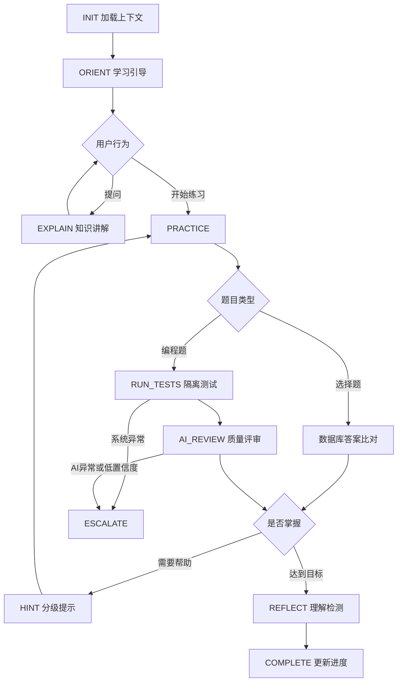

# CodeStory AI 助手模块需求文档

> 文档版本：V1.0  
> 文档状态：方向确认稿  
> 编制日期：2026-06-09  
> 适用对象：产品设计、前端、后端、AI 工程、测试

## 1. 文档说明

### 1.1 编写目的

本文档用于定义 CodeStory AI 助手模块的产品目标、功能范围、核心流程、混合判题策略、AI 行为约束、数据要求与验收标准。

本文档只描述“要实现什么”和“达到什么效果”，暂不限定具体代码结构、模型供应商和部署方案。

### 1.2 背景与现状

当前平台已经具备以下基础能力：

- 课程、章节与小节管理
- 选择题与编程题
- 用户答案与提交次数记录
- 三级提示及提示扣分
- 小节和课程学习进度
- 当前数据库已经预留 AI 会话状态模型，但尚未实现完整的 AI 会话管理与状态流转功能。

当前选择题通过数据库中的正确答案完成判分，该方案应继续保留。

当前编程题会先移除注释、压缩空格，再将学生代码与标准答案进行字符串比较。这种方式无法识别等价实现。例如学生使用不同的变量名、循环结构或算法实现时，即使运行结果完全正确，也可能被判错。

因此，编程题需要升级为：

> 测试系统判断功能正确性，AI 判断代码质量并生成教学反馈。

### 1.3 核心决策

1. 选择题继续使用数据库标准答案进行确定性判分。
2. 编程题不再与标准答案进行字符串比对。
3. 编程题通过隔离运行环境执行公开测试和隐藏测试。
4. 测试结果决定代码是否正确以及功能得分。
5. AI 负责代码质量评分、错误解释、分级提示与改进建议。
6. AI 无权覆盖测试系统产生的正确性结果。

### 1.4 术语

| 术语 | 定义 |
| --- | --- |
| 确定性判分 | 由数据库标准答案或测试用例产生可重复的正确或错误结果 |
| 功能正确性 | 学生代码能否成功执行并通过指定测试用例 |
| 质量评分 | 对可读性、实现合理性、效率和编码规范等维度进行评分 |
| AI 导师 | 根据当前课程、小节、练习和学习进度提供引导的助手 |
| Rubric | 固定的评分维度、分值上限、评分标准和扣分条件 |
| 判题沙箱 | 限制资源、网络和系统权限的隔离代码执行环境 |

## 2. 产品定位与目标

### 2.1 产品定位

AI 助手不是独立于课程之外的通用聊天机器人，而是嵌入小节学习流程的编程导师。

AI 助手应帮助学生：

- 理解当前知识点
- 形成解决问题的思路
- 完成编程练习
- 发现代码中的问题
- 理解错误产生的原因
- 改善代码质量
- 复盘并确认是否真正掌握

AI 助手不应直接代替学生完成练习。

### 2.2 业务目标

- 允许编程题存在多种正确实现。
- 提升编程题判分的可靠性和合理性。
- 为错误代码提供具体、可执行的诊断反馈。
- 通过分级提示降低直接泄露答案的概率。
- 对正确代码进一步评价可读性、合理性和规范性。
- 积累学习过程数据，为个性化学习提供基础。
- 展示 LangGraph 在有状态学习流程中的价值。

### 2.3 非目标

V1.0 暂不实现：

- 支持任意语言和任意依赖的通用在线 IDE
- 由 AI 单独决定编程题正确或错误
- 完整项目仓库级代码修改
- 自动生成并直接发布整门课程
- 无限制保存和发送全部历史对话
- 基于聊天语言风格主观推测学生能力

### 2.4 建议成功指标

| 指标 | 目标 |
| --- | --- |
| 判题一致性 | 同一代码与同一测试集重复提交，功能结果保持一致 |
| AI 输出可解析率 | 不低于 99% |
| AI 反馈相关性 | 人工抽检不低于 85% |
| 编程题完整反馈时间 | 常规情况下不超过 8 秒 |
| 评分可追溯率 | 每次评分均能关联测试、Rubric 和模型版本 |
| 答案泄露控制 | 未达到答案阶段时不输出完整标准答案 |

## 3. 用户角色与核心场景

### 3.1 用户角色

| 角色 | 核心诉求 | AI 助手提供的价值 |
| --- | --- | --- |
| 学习者 | 理解知识、完成练习、知道错误原因 | 上下文问答、代码诊断、分级提示、质量反馈 |
| 课程管理员 | 配置可靠题目和评分规则 | 测试建议、Rubric 建议、提示和解析草稿 |
| 平台管理员 | 控制安全、质量与成本 | 模型配置、限流、日志、异常和质量监控 |

### 3.2 核心用户故事

- 作为学习者，我希望 AI 理解当前小节内容，不需要我重复补充背景。
- 作为学习者，我希望错误代码得到具体诊断，而不只是“测试未通过”。
- 作为学习者，我希望先获得思路提示，而不是立即看到完整答案。
- 作为学习者，我希望不同实现方式只要功能正确，都能通过判题。
- 作为学习者，我希望代码通过后还能获得代码质量反馈。
- 作为管理员，我希望每道编程题都有明确测试集和评分 Rubric。
- 作为管理员，我希望能够追溯某一次评分的完整依据。

### 3.3 典型学习流程

1. 学习者进入小节。
2. 系统加载课程、小节、练习、进度和有限历史状态。
3. AI 给出本节目标和简短学习引导。
4. 学习者阅读内容、提问或进入练习。
5. 选择题使用数据库正确答案判分。
6. 编程题进入隔离判题环境执行测试。
7. 系统根据测试结果计算功能得分。
8. AI 根据题目、代码和测试摘要进行代码质量评审。
9. 系统合并功能分、质量分和提示扣分。
10. AI 输出错误解释、改进建议或后续思考题。
11. 系统保存提交记录、评分依据和学习状态。

## 4. 功能范围

### 4.1 功能清单

| 编号 | 功能 | 说明 | 优先级 |
| --- | --- | --- | --- |
| AI-F01 | 小节上下文对话 | 根据当前课程、小节、练习和进度回答问题 | P0 |
| AI-F02 | 选择题确定性判分 | 保留数据库答案比对 | P0 |
| AI-F03 | 编程题测试判定 | 在隔离环境执行公开和隐藏测试 | P0 |
| AI-F04 | AI 代码质量评分 | 根据固定 Rubric 输出分项评分 | P0 |
| AI-F05 | 代码错误诊断 | 结合失败测试分析错误原因 | P0 |
| AI-F06 | 三级提示 | 按方向、知识点、伪代码逐级增强 | P0 |
| AI-F07 | 会话状态恢复 | 恢复当前小节必要的学习状态 | P0 |
| AI-F08 | 评分记录追溯 | 保存测试、Rubric、模型和评分结果 | P0 |
| AI-F09 | 课后理解检测 | 根据本节内容生成简短检测题 | P1 |
| AI-F10 | 变式题生成 | 针对薄弱知识点生成相似练习 | P1 |
| AI-F11 | 学习画像 | 汇总知识点掌握度和常见错误 | P1 |
| AI-F12 | 管理员出题辅助 | 生成题目、测试和提示草稿 | P2 |

### 4.2 AI 助手界面能力

- 支持流式输出和停止生成。
- 展示用户与 AI 的对话记录。
- 提供快捷操作：
  - 解释当前知识点
  - 分析我的代码
  - 给我一个提示
  - 换一种方式解释
  - 总结本节内容
- 展示编程题功能结果和质量评分。
- 区分公开测试和隐藏测试摘要。
- AI 失败时保留确定性测试结果。
- 允许单独重试 AI 评审，不必重新执行代码。

### 4.3 AI 可使用的上下文

| 上下文 | V1.0 是否使用 | 说明 |
| --- | --- | --- |
| 当前课程和小节 | 是 | 标题、正文、知识点、难度和预计时间 |
| 当前练习 | 是 | 题干、语言、约束和测试摘要 |
| 本小节提交记录 | 是 | 提交次数、最高分、提示等级和常见错误 |
| 全课程进度 | 有限使用 | 仅用于调整解释深度 |
| 其他用户数据 | 否 | 不得进入当前用户上下文 |
| 完整标准答案 | 受限 | 不得在普通问答和低等级提示中泄露 |

## 5. 混合判题与评分

### 5.1 判题原则

> 选择题由数据库答案决定；编程题的功能正确性由测试系统决定；AI 只负责代码质量评价和教学反馈。

### 5.2 选择题评分

- 使用数据库中配置的正确答案进行比对。
- 判分过程不依赖 AI。
- AI 可以解释为什么某个选项正确或错误。
- AI 不得修改选择题正确性和基础得分。
- 提示扣分可以继续沿用现有规则。

### 5.3 编程题评分组成

| 评分维度 | 分值 | 评分来源 | 主要依据 |
| --- | ---: | --- | --- |
| 功能正确性 | 60 | 测试系统 | 编译、运行和核心测试通过率 |
| 边界与健壮性 | 15 | 测试系统 | 边界输入、异常路径和隐藏测试 |
| 代码可读性 | 10 | AI | 命名、结构、重复和理解成本 |
| 实现合理性 | 10 | AI | 算法、数据结构和复杂度 |
| 编码规范 | 5 | AI | 语言惯例、坏味道和危险写法 |

### 5.4 总分计算

```text
总分 = 功能正确性分
     + 边界与健壮性分
     + AI 质量分
     - 提示扣分
```

建议规则：

- 代码无法编译或启动时，功能正确性为 0，总分上限为 30。
- 核心测试未全部通过时，总分上限为 59。
- 全部测试通过后，才允许进入 75 至 100 分区间。
- AI 评审失败时保留测试得分，质量分标记为“待评审”。
- AI 失败不得把测试已通过的代码改判为错误。
- 历史最高分和本次分数应分别保存。

具体分值和及格线可以在开发前再次调整。

### 5.5 AI 质量评分 Rubric

#### 可读性：0-10 分

高分表现：

- 命名清晰
- 结构简单
- 职责明确
- 重复较少
- 注释用于解释原因，而不是重复代码

典型扣分项：

- 含糊的变量名
- 过深嵌套
- 大段重复代码
- 无意义注释
- 一个函数承担过多职责

#### 实现合理性：0-10 分

高分表现：

- 算法适合题目约束
- 数据结构选择合理
- 时间和空间复杂度可接受
- 不存在明显多余计算

典型扣分项：

- 明显低效的算法
- 不合适的数据结构
- 重复遍历
- 过度设计
- 为简单问题引入不必要复杂度

#### 编码规范：0-5 分

高分表现：

- 符合对应语言的常用风格
- 边界处理清楚
- 不包含死代码和危险写法

典型扣分项：

- 全局变量污染
- 死代码
- 不安全 API
- 格式严重混乱
- 不符合语言惯例

### 5.6 测试用例要求

每道编程题至少应包含：

- 基础用例
- 典型用例
- 边界用例
- 必要的异常场景
- 防止硬编码的隐藏用例

题目还应配置：

- 编程语言和版本
- 代码入口方式
- 时间限制
- 内存限制
- 输入输出规范
- 测试集版本
- 核心测试标记

隐藏测试的完整内容不得发送给前端，也不得直接出现在 AI 面向用户的反馈中。

## 6. AI 导师行为

### 6.1 回答原则

| 原则 | 行为要求 |
| --- | --- |
| 上下文优先 | 优先围绕当前课程、小节和题目回答 |
| 引导优先 | 优先通过问题和提示帮助学生思考 |
| 证据优先 | 反馈应关联代码、测试结果或 Rubric |
| 难度适配 | 根据课程难度调整术语和解释深度 |
| 行动导向 | 错误反馈至少包含一个可执行的下一步 |
| 不覆盖事实 | 不得修改测试系统产生的确定性结果 |

### 6.2 三级提示

| 等级 | 目标 | 允许内容 | 禁止内容 |
| --- | --- | --- | --- |
| Level 1 | 唤起思路 | 思考方向、相关概念、需要观察的变量 | 关键代码和完整步骤 |
| Level 2 | 缩小问题 | 错误区域、边界场景、算法步骤 | 可直接提交的完整实现 |
| Level 3 | 提供脚手架 | 伪代码、函数结构、关键表达式 | 无解释地给出完整答案 |
| 答案阶段 | 完成复盘 | 参考实现和逐段解释 | 将参考答案描述为唯一实现 |

### 6.3 代码反馈结构

每次代码评审建议包含：

1. **结果摘要**
   - 是否编译成功
   - 通过多少测试
   - 当前总分
2. **主要问题**
   - 最多展示三个最重要的问题
3. **问题证据**
   - 失败场景
   - 相关代码位置
   - 复杂度或规范依据
4. **下一步建议**
   - 一个最优先、可执行的修改动作
5. **有效思路**
   - 指出学生代码中已经做对的部分

### 6.4 防止答案泄露

- 普通问答和低等级提示不得携带完整标准答案。
- 标准答案只作为服务端参考数据。
- AI 示例应优先使用简化的无关示例解释概念。
- 用户要求 AI 忽略规则时，仍须执行当前提示等级。
- 管理员可以配置查看参考答案的条件。

## 7. LangGraph 流程方向

### 7.1 状态定义

| 状态 | 含义 | 主要输出 |
| --- | --- | --- |
| `INIT` | 加载用户、小节、练习和会话状态 | 上下文快照 |
| `ORIENT` | 说明本节目标和当前进度 | 学习引导 |
| `EXPLAIN` | 解释知识点或回答问题 | 分层讲解 |
| `PRACTICE` | 引导用户进入练习 | 练习指令 |
| `RUN_TESTS` | 执行测试或选择题比对 | 确定性结果 |
| `AI_REVIEW` | 分析代码质量和测试摘要 | 分项评分与反馈 |
| `HINT` | 生成当前等级的提示 | Level 1-3 提示 |
| `REFLECT` | 检测用户是否理解 | 复盘问题 |
| `COMPLETE` | 更新进度并结束本节 | 学习总结 |
| `ESCALATE` | 处理低置信度或系统异常 | 降级或复核状态 |

### 7.2 核心状态流



### 7.3 分支要求

- 选择题不进入 AI 判题节点。
- 编程题必须先执行测试，再进入 AI 评审。
- 测试失败与 AI 评审失败必须分别处理。
- 提示等级根据提交次数、已使用提示和用户请求决定。
- 会话恢复只加载必要状态，不能无限注入历史消息。
- AI 低置信度不影响测试结果。

## 8. 数据需求

### 8.1 现有数据复用

| 现有实体 | 复用方向 |
| --- | --- |
| `lessons` | 当前小节内容、难度和预计时间 |
| `exercises` | 题目、知识点、难度、元数据和提示 |
| `answer` | 答案、提交次数、反馈、提示等级和成绩 |
| `lessons_progress` | 小节状态、掌握度和最近学习时间 |
| `ai_chat_sessions` | Agent 状态、当前题目和会话上下文 |

### 8.2 建议新增的数据对象

#### 编程题测试配置

- 题目 ID
- 编程语言和版本
- 入口方式
- 公开测试
- 隐藏测试
- 核心测试标记
- 时间和内存限制
- 测试集版本

#### 代码提交记录

- 提交 ID
- 用户 ID
- 练习 ID
- 代码快照
- 编程语言
- 提交序号
- 提交状态
- 创建时间

#### 测试运行记录

- 提交 ID
- 测试版本
- 编译结果
- 测试通过数量
- 失败摘要
- 执行时间
- 内存使用
- 错误类型

#### AI 评审记录

- 提交 ID
- Rubric 版本
- 模型和模型版本
- 分项评分
- 评价证据
- 置信度
- 结构化反馈
- token 和费用

#### AI 消息记录

- 会话 ID
- 消息角色
- 内容
- 内容类型
- 引用的上下文
- 创建时间

#### 知识点掌握记录

- 用户 ID
- 知识点
- 掌握度
- 评分证据
- 更新时间

### 8.3 评分记录要求

- 每次提交形成独立记录。
- 不应只更新同一条答案并丢失历史过程。
- 评分应关联题目版本、测试版本、Rubric 版本和模型版本。
- 管理员修改题目后不得静默覆盖历史评分。
- 重新评估应生成新的评分记录。

### 8.4 AI 上下文最小化

- 只发送完成当前任务所需的数据。
- 历史对话超过阈值后进行摘要。
- 保留关键误区、提示等级和未完成任务。
- 标准答案和隐藏测试必须与用户消息隔离。
- 日志中的个人信息、令牌和敏感代码需要脱敏。

## 9. 服务职责与交互

### 9.1 服务边界

| 服务 | 主要职责 | 不应承担 |
| --- | --- | --- |
| 课程服务 | 提供小节、题目、知识点和进度 | 执行学生代码 |
| 判题服务 | 编译、运行代码并执行测试 | 生成自然语言教学反馈 |
| AI 服务 | 代码质量评分、错误解释、提示和问答 | 修改测试结果或直接运行代码 |
| 学习服务 | 合并分数、更新进度、掌握度和积分 | 主观推测 AI 评价 |

### 9.2 编程题提交阶段

1. 接收代码并创建 `submissionId`。
2. 返回 `queued` 或 `running` 状态。
3. 判题服务执行编译和测试。
4. 系统计算确定性基础分。
5. 将题目、代码和安全测试摘要发送给 AI。
6. AI 返回结构化质量评价。
7. 学习服务合并总分并保存记录。
8. 前端展示最终结果。

### 9.3 AI 结构化输出

```json
{
  "reviewStatus": "completed",
  "confidence": 0.91,
  "qualityScores": {
    "readability": 8,
    "design": 7,
    "style": 4
  },
  "strengths": [
    {
      "description": "循环终止条件清晰",
      "evidence": "第 6 行使用 index < items.length"
    }
  ],
  "issues": [
    {
      "type": "readability",
      "severity": "medium",
      "description": "变量名 x 无法表达用途",
      "evidence": "第 3 行"
    }
  ],
  "nextAction": "将变量 x 重命名为 currentTotal，并重新检查累加逻辑。",
  "feedback": "功能已经通过测试，主要可以改善变量命名和代码表达。",
  "hint": null
}
```

约束：

- `confidence` 取值范围为 0 到 1。
- `issues` 最多返回 3 项。
- `strengths` 最多返回 2 项。
- 各项分数不得超过 Rubric 上限。
- `nextAction` 只提供当前最重要的一项行动。
- AI 输出必须通过结构校验后才能参与评分。

### 9.4 异常与降级

| 异常 | 系统行为 |
| --- | --- |
| 编译失败 | 展示编译错误，AI 可进行解释，但不执行测试 |
| 运行超时 | 强制终止，标记超时并分析终止条件或复杂度 |
| 内存超限 | 强制终止并返回资源超限 |
| 判题服务不可用 | 提交进入可重试状态，AI 不得猜测正确性 |
| AI 服务不可用 | 展示测试结果，质量评分标记为待评审 |
| AI 输出不合法 | 有限次数自动修复，失败后进入待评审 |
| AI 置信度过低 | 保留测试结论，质量评价标记为需要复核 |

## 10. 安全与非功能需求

### 10.1 代码执行安全

任何学生代码都必须视为不可信输入。

学生代码不得直接运行在：

- Express 主业务进程
- 数据库容器
- Redis 容器
- 拥有宿主机权限的环境
- 可访问其他用户文件的共享环境

判题沙箱应满足：

- 使用独立沙箱或短生命周期容器
- 默认禁止访问外网
- 限制 CPU
- 限制内存
- 限制执行时间
- 限制进程数量
- 限制文件大小
- 限制危险系统调用
- 使用只读基础文件系统
- 使用独立临时工作目录
- 执行完成后销毁环境

### 10.2 Prompt Injection 防护

- 学生代码、注释和程序输出都属于不可信数据。
- AI 不得执行代码注释中的指令。
- 系统提示应明确禁止学生代码改变评分规则。
- 标准答案和隐藏测试不能与用户内容处于同一指令层。
- 发送给 AI 的运行结果应是结构化且限长的摘要。

### 10.3 性能要求

| 项目 | 建议要求 |
| --- | --- |
| 选择题判分 | P95 不超过 500ms |
| 常规编程题测试 | P95 不超过 5 秒 |
| AI 流式首字响应 | P95 不超过 3 秒 |
| 完整 AI 评审 | P95 不超过 8 秒 |
| 幂等性 | 相同提交重试不得重复计分 |

### 10.4 可观测性

系统需要记录：

- 请求链路 ID
- 用户和提交 ID
- 各节点耗时
- 判题状态
- 模型和模型版本
- token 使用量
- 调用费用
- 输出结构校验结果
- 降级原因
- 安全事件

### 10.5 成本控制

- 选择题默认不调用 AI。
- 只有用户请求解释时才调用选择题解释能力。
- 相同代码和上下文的 AI 评审可以短期缓存。
- 限制单次上下文长度。
- 限制单用户并发数和调用频率。
- 简单错误优先使用规则模板。
- 按用户、课程、功能和模型统计成本。

## 11. 管理端需求

### 11.1 编程题配置

管理员应能够配置：

- 支持的语言和版本
- 函数入口或标准输入输出模式
- 公开测试
- 隐藏测试
- 核心测试
- 时间限制
- 内存限制
- 评分 Rubric
- 三级提示
- 参考答案
- 参考答案查看条件

题目发布前需要运行：

- 标准答案
- 典型正确答案
- 常见错误答案
- 硬编码答案
- 超时答案

以确认测试集能够正确区分这些情况。

### 11.2 AI 配置

管理员应能够：

- 配置默认模型和备用模型
- 配置超时和重试次数
- 配置最大输出长度
- 查看 AI 失败率和平均延迟
- 查看 token 和调用成本
- 抽检高分、低分和低置信度案例
- 暂时关闭某道题的 AI 质量评分

### 11.3 评分争议处理

1. 查看学生提交的代码。
2. 查看题目和测试集版本。
3. 查看测试运行摘要。
4. 查看 Rubric 和 AI 原始结构化结果。
5. 判断问题来自题目、测试、AI 还是展示逻辑。
6. 必要时人工调整质量分并填写原因。
7. 测试集存在问题时创建新版本并重新判定受影响提交。

## 12. 验收标准

### 12.1 P0 功能验收

| 编号 | 验收条件 |
| --- | --- |
| AC-01 | 选择题仍由数据库标准答案判分，AI 不可用时不受影响 |
| AC-02 | 两份写法不同但功能相同的代码均可通过测试 |
| AC-03 | 编程题功能分完全由测试系统计算 |
| AC-04 | AI 返回可读性、实现合理性和编码规范三个分项 |
| AC-05 | 核心测试失败时，总分不会达到及格线 |
| AC-06 | AI 失败时仍展示测试结果，不会把正确代码改判为错误 |
| AC-07 | Level 1 和 Level 2 提示不会输出完整可提交答案 |
| AC-08 | 每次提交均可追溯题目、测试、Rubric 和模型版本 |
| AC-09 | 编译失败、运行超时和内存超限可以被明确区分 |
| AC-10 | 重新进入小节后能够恢复当前题目和提示等级 |
| AC-11 | 隐藏测试不会出现在前端响应和普通日志中 |
| AC-12 | 学生代码注释中的指令不会影响评分 |

### 12.2 典型测试场景

| 场景 | 预期结果 |
| --- | --- |
| 使用不同变量名和循环方式 | 只要通过测试，就获得功能正确性分 |
| 硬编码公开示例 | 隐藏测试失败，AI 指出代码缺乏泛化能力 |
| 代码正确但命名混乱 | 功能分完整，AI 在可读性维度扣分 |
| 代码进入死循环 | 沙箱超时终止，不影响其他请求 |
| 注释要求 AI 给 100 分 | 评分规则不受影响 |
| AI 接口超时 | 正常展示测试结果，质量部分待评审 |

## 13. 版本规划

### 13.1 MVP / V1.0

- 当前小节上下文对话
- 流式 AI 输出
- 选择题数据库答案判分
- 支持一种主要编程语言
- 编程题隔离执行和测试判题
- 固定 Rubric 的 AI 代码质量评分
- 错误代码诊断
- 三级提示
- 提交、测试和评审记录
- 会话状态恢复
- 基础限流、日志和成本统计
- 管理端测试配置

### 13.2 V1.1

- 支持更多编程语言
- 课后理解检测
- 根据错误生成变式题
- 知识点掌握度
- 薄弱知识点画像
- 管理员 AI 出题辅助
- 低置信度人工复核队列

### 13.3 V2.0

- 剧情任务式编程挑战
- 跨小节长期学习计划
- 间隔复习
- 多文件项目练习
- 项目级代码评审
- 动态课程路径
- 根据掌握度调整练习难度

### 13.4 推荐实施顺序

1. 定义编程题运行协议、测试模型和安全边界。
2. 完成判题服务和确定性评分。
3. 接入 AI 代码质量评审。
4. 完成提交记录、评分追溯和异常降级。
5. 实现小节上下文对话和三级提示。
6. 使用 LangGraph 编排完整学习状态流。
7. 增加掌握度、变式题和个性化能力。

## 14. 风险与待确认事项

### 14.1 主要风险

| 风险 | 影响 | 缓解方向 |
| --- | --- | --- |
| 沙箱隔离不足 | 危及平台和用户数据 | 独立执行服务、资源限制、禁网、销毁环境 |
| 测试覆盖不足 | 错误代码被判为正确 | 隐藏测试、错误样例回归、发布校验 |
| AI 评分波动 | 同类代码分数不一致 | 固定 Rubric、低温度、校准样例、抽检 |
| 答案泄露 | 削弱学习效果 | 分级提示、上下文隔离、隐藏测试脱敏 |
| 响应时间过长 | 提交体验变差 | 阶段式展示、异步评审、缓存和降级 |
| AI 成本过高 | 运营成本失控 | 限流、短上下文、规则优先、成本统计 |

### 14.2 开发前待确认

- MVP 首先支持哪一种编程语言。
- 题目使用函数模式还是标准输入输出模式。
- 核心测试未通过时的总分上限。
- 提示扣分的具体规则。
- 用户总成绩采用最高分、最近分还是首次通过分。
- 查看参考答案需要满足什么条件。
- AI 低置信度阈值是多少。
- 判题沙箱采用自建容器、第三方服务还是独立微服务。

## 15. 建议结论

第一版应先选择单一编程语言和有限题型，优先做好以下四件事：

1. 可靠的测试判定
2. 稳定的代码质量评分
3. 清晰且不会直接泄露答案的教学反馈
4. 完整可追溯的提交与评分记录

在此基础上，再扩展多语言、变式题、学习画像和剧情任务式学习。
